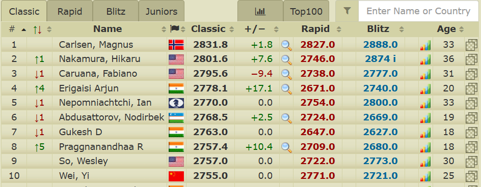

# ♛ Grandmaster Grapher ♚

## Project Overview

The Grandmaster Grapher project is a dynamic and visually appealing tool designed to scrape live world rankings and performance metrics of the top 10 chess players from 2700chess.com. The project leverages web scraping techniques to gather real-time data, saves it in a CSV format, and visualizes it in an insightful graph using Matplotlib.

## 🚀 Getting Started

### Installation

Make sure you have the required Python libraries installed:

```bash
pip install requests beautifulsoup4 matplotlib
```

### Usage

1. **Run the Script:**
   Execute the Python script to scrape live data, save it in CSV format, and generate the graph.

   ```bash
   python grandmaster grapher.py
   ```

2. **Explore the Results:**
   Open the generated `chess_ratings.csv` file to explore the collected data. The graph will also be displayed to provide a visual representation of the top 10 chess players' rankings and ratings.

## 🛠 Implementation

The project utilizes the following Python libraries:

- **Requests:** For sending HTTP requests and retrieving webpage content.
- **BeautifulSoup:** To parse and extract relevant data from the HTML structure.
- **Matplotlib:** For creating graphical visualizations of the collected data.
- **CSV:** Handling data storage in CSV format.

## 📊 Graphical Visualization

The generated graph displays the following information for each player:

- **Ranking:** Current world ranking.
- **Name:** Player's name.
- **Classical Rating:** Player's rating in classical time control.
- **Rapid Rating:** Player's rating in rapid time control.
- **Blitz Rating:** Player's rating in blitz time control.

## 🌐 Data Source

Data is scraped in real-time from [2700chess.com](https://2700chess.com/), a popular chess statistics website.

# Insights

## Performance Trends
The visualization provided by Grandmaster Grapher reveals insightful performance trends among the top 10 chess players in classical, rapid, and blitz time controls. Understanding these trends offers valuable insights into player strengths and preferences across different game formats.

## Player Comparisons
The tool facilitates easy comparisons between players, enabling enthusiasts and analysts to identify disparities and similarities in their ratings and rankings. This comparative analysis contributes to a better understanding of individual player dynamics.

## Age vs. Rating Correlation
Connecting player age with their respective ratings unveils potential correlations between age and performance. This insight could spark further analysis into the dynamics of chess players' careers and the impact of age on their playing styles.

## 🎉 Conclusion

Grandmaster Grapher offers a vibrant and insightful snapshot of the top 10 chess players' standings and ratings. Automate your data analysis process and enjoy visually rich representations of players' performances across different chess time controls!
